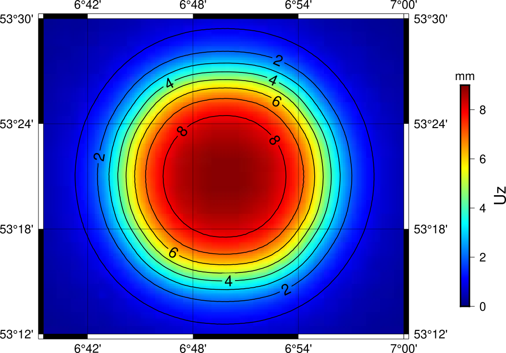
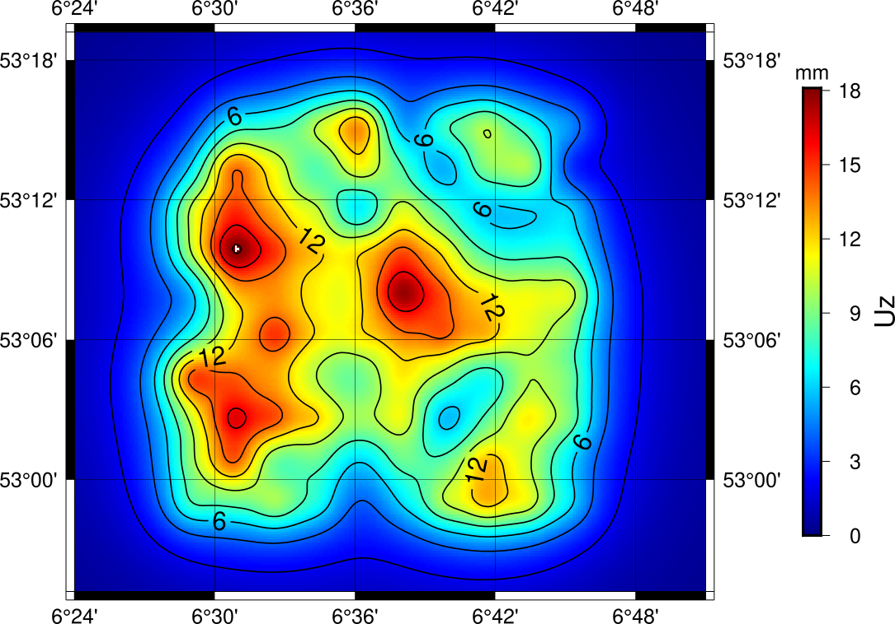

# Particle filter implementation for compacting reservoir

Code with simple example using a static implementation of the particle filter, i.e., the particle method (Vossepoel et al. 2008).

This repository provides the implementation of the particle filter for two conceptual models of reservoir from Kim et al. 2023 (<a href="https://link.springer.com/article/10.1007/s10596-023-10264-9">https://link.springer.com/article/10.1007/s10596-023-10264-9</a>).

## 1. Subsidence models
In the following a compacting reservoir gives a subsidence field at the Earth's surface.
The subsidene field can have a varying smoothness given the compaction field in the reservoir with for example a very smooth subsidence bowl or a very spatially uncorrelated subsidence field:

### 1a. One-component model

### 2a. Multi-component model

## 2. Particle filter 
### 2a. Example with the maximal weight

