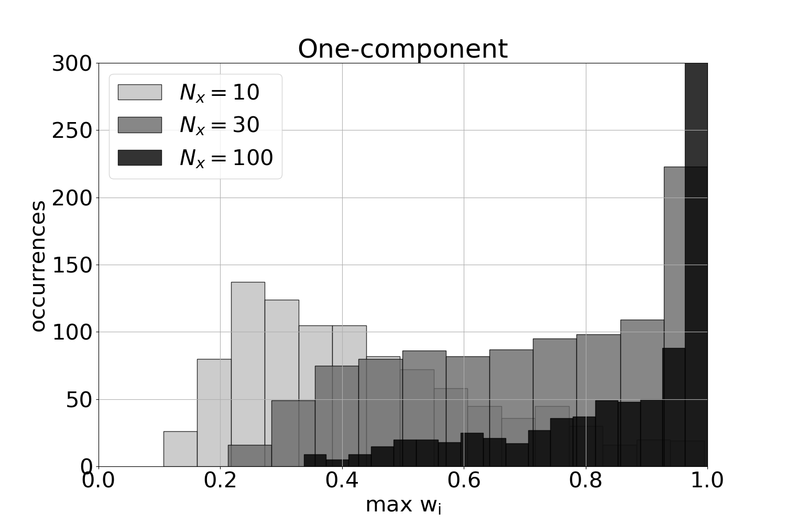
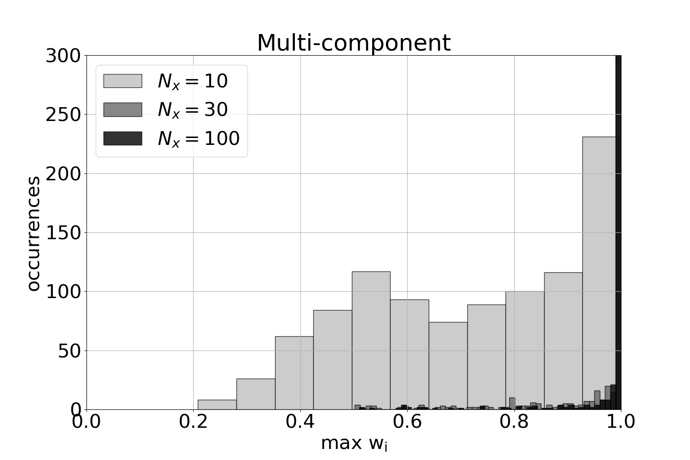

# Particle filter implementation for compacting reservoirs

Code with simple example using a static implementation of the particle filter, i.e., the particle method (Vossepoel et al. 2008).

This repository provides the implementation of the particle filter for two conceptual models of reservoir from Kim et al. 2023 (<a href="https://link.springer.com/article/10.1007/s10596-023-10264-9">https://link.springer.com/article/10.1007/s10596-023-10264-9</a>).

To run the code, execute the makefile:
```batch
make
```


## 1. Subsidence models
In the following a compacting reservoir gives a subsidence field at the Earth's surface.
The subsidence field has a varying smoothness given the reservoir compaction field, with for example a very smooth subsidence bowl or a very spatially uncorrelated subsidence field:


## 2. Particle filter 
Example with the maximal weight

### 2a. One-component model


### 2b. Multi-component model

